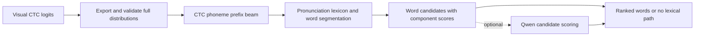

# Phoneme probability → words decoder

A framework for decoding **complete CTC phoneme distributions into ranked word
sequences**, using the visual models, CMUdict work, and optional Qwen adapter
already in VALLRITE.

**Status: initial runnable Python reference plus design contracts.** The runtime
accepts the current VisualPhoneme models' `[T,B,40]` logits through an adapter,
or exported full probability rows. It incrementally constrains CTC prefixes with
a pronunciation trie and segments complete hypotheses into ranked words.

## Run it

From the repository root, no third-party decoder dependencies are needed:

```bash
python -m PhonemeDecoder PhonemeDecoder/examples/request.json \
  --lexicon PhonemeDecoder/examples/lexicon.json \
  --output /tmp/words.json
```

Use the existing visual predictor's Python environment for real video:

```bash
python -m VisualPhoneme.predict clip.mp4 --checkpoint path/to/best.pt \
  --emissions-output /tmp/emissions.json --word-lexicon path/to/lexicon.json
```

Coordinate/fusion models still need their existing `--landmarks-npz` argument.
`--word-lexicon` adds `word_decoding` to the existing predictor result;
`--emissions-output` is independently optional. Use a real lexicon matching your
application: the supplied example only knows pat, bat, and mat.

Generate realistic candidate-ranking examples from a frozen visual checkpoint
and measure the lexical decoder on GRID:

```bash
.venv-vpa-gpu/bin/python -m PhonemeDecoder.evaluate_grid \
  --checkpoint path/to/best.pt --split train \
  --output-dir datasets/decoder-training/grid-train
```

This writes `examples.jsonl`, the generated runtime `lexicon.json`, a summary,
and a dual-output log. Each example contains the reference words and phones,
greedy visual phones, ranked lexical candidates, and Top-1/oracle errors. A run
on `train` is explicitly marked as an in-sample diagnostic because the visual
producer has already seen those speakers. Use out-of-fold visual checkpoints
before treating these records as unbiased decoder-training data. The command
does not expose locked test speakers.

```python
from PhonemeDecoder import Lexicon, StreamingDecoder, probabilities_from_logits

decoder = StreamingDecoder(Lexicon(lexicon_document), beam_width=16)
rows = probabilities_from_logits(logits, checkpoint["phones"], valid_steps)
decoder.accept(rows)  # Or accept successive, non-overlapping chunks.
result = decoder.result(nbest=5)
decoder.reset()  # New utterance; state must not cross utterance boundaries.
```

The runtime is deliberately narrower than the proposed schemas: it emits
`phoneme-decoder-runtime-0.1`, with ranked word IDs, text, and unnormalized log
scores. It does not claim conformance to the full design response envelope.
It uses pronunciation priors but has no trained word LM or Qwen dependency.
Input rows must be full normalized probabilities, not the predictor's top-N
phone candidates. The direct adapter checks the checkpoint inventory and valid
length. The CLI also accepts the design's simple probability fixture, but does
not implement resource hashes, calibration, or all design request semantics.

Phone and lexical beams, maximum steps, phones, and words bound work per
utterance. Phone/step overflow raises an error; lexical/word caps prune paths.
A raised update may have consumed earlier rows in that chunk; reset before retry.
Results are provisional complete dictionary paths and can change with more input.
No endpoint detector or committed-word interface is implemented. The current
visual models still run whole clips; streaming the decoder does not make those
noncausal models streaming. Python speed on a phone, energy use, and vocabulary
scaling remain unmeasured. Native implementation and device profiling are next.

## Recommended starting point

Use the compact `VisualPhoneme` model as the first producer. Export its full
blank-plus-39-phone distribution at each valid output step. Apply CTC prefix
beam search, segment the retained phoneme sequences through a pronunciation
lexicon, and rank word candidates with an explicit language score. Retain
alternatives and component scores. Add Qwen only as a bounded candidate reranker
once the lexical baseline is measured.



The first reference decoder deliberately uses two stages so CTC correctness and
lexical segmentation can be tested separately. This may prune a useful phone
sequence before the lexicon sees it. Measure that loss explicitly; move to a
joint lexicon/CTC search or WFST when the reference exposes a search bottleneck.
An N-best list is not a complete lattice.

## What the existing project contributes

| Existing work | Reuse | Required change or limitation |
|---|---|---|
| [`VisualPhoneme/model.py`](../VisualPhoneme/model.py) | Image-only and image/landmark fusion CTC models; one output step per frame | Export time-major logits `[T,B,40]` with valid lengths, model vocabulary, and source timing |
| [`VisualPhoneme/predict.py`](../VisualPhoneme/predict.py) | Checkpoint loading, crop selection, inference | Currently saves greedy phones and a blank summary, not the full distribution; fusion truncation must be recorded |
| [`vallrite.py`](../vallrite.py) | Older VALLR logits, CTC blank convention, greedy baseline, Qwen path | Logits are `[B,T,40]`; rounded top-5 output cannot reconstruct missing probability mass |
| [`train_phoneme_dictionary.py`](../tools/train_phoneme_dictionary.py) | CMUdict normalization and local LoRA training machinery | Single-word deterministic examples do not train a probability-aware sentence decoder; retain all pronunciations and homophones |
| [`VisualPhoneticAlphabet`](../VisualPhoneticAlphabet/README.md) | Observations, missing-data metadata, experimental evidence | Gesture compatibility and geometric proxies are not phoneme emission probabilities |
| [`VisualPhoneticAlphabet/evaluate.py`](../VisualPhoneticAlphabet/evaluate.py) | Token edit-distance scoring pattern | Add word-level scoring, oracle candidate recall, and search/resource diagnostics |

The old VALLR smoke test emitted only eight CTC steps for 16-phone references;
no decoder can recover a complete 16-phone CTC path from eight steps. The newer
compact recognizer avoids that structural limit, but its current results remain
validation results with substantial error. See the respective
[old-model diagnostic](../VisualPhoneticAlphabet/evaluation/README.md) and
[compact-model results](../VisualPhoneme/evaluation/README.md). This framework
makes no new accuracy claim.

## Artifacts in this folder

- [DESIGN.md](DESIGN.md): algorithms, scores, alternatives, failure behavior,
  integration, and evaluation gates.
- [schemas/request.schema.json](schemas/request.schema.json): full CTC
  probability input and bounded search configuration.
- [schemas/response.schema.json](schemas/response.schema.json): N-best word
  output, explicit scores, diagnostics, and failure states.
- [schemas/lexicon.schema.json](schemas/lexicon.schema.json): versioned
  pronunciation alternatives, including homophones.
- [examples](examples/README.md): synthetic ambiguous `P/B/M AE T` request and
  tiny lexicon. These are format fixtures, not measured model predictions.

JSON Schema checks structural constraints. The decoder must additionally check
normalization, vocabulary agreement, monotonic timestamps, hash integrity,
score identities, and status/candidate consistency as specified in DESIGN.md.

## Planned Python boundary

These original design signatures remain **proposed**; use the runtime API above:

```python
# Producer adapter: no dependency on a particular visual architecture.
export_ctc(logits, *, layout, valid_length, vocabulary, step_times_ms,
           model_fingerprint, preprocessing_fingerprint) -> EmissionRecord

# Offline resource preparation; preserve pronunciations and lexical identity.
build_lexicon(entries, *, phone_inventory, source_revision) -> Lexicon

# Reference decoder stages, run in log space.
ctc_prefix_beam(emissions, *, beam_width) -> list[PhoneHypothesis]
segment_words(phone_hypotheses, lexicon, lm, *, lexical_beam) -> list[WordCandidate]
aggregate_and_rank(candidates, config) -> DecodeResult

# Optional second pass: score only existing complete candidates.
rerank(candidates, scorer, *, visual_score_window) -> DecodeResult
```

## First implementation checklist

1. Implement request validation and full-posterior exporters for the two CTC
   tensor layouts. Preserve existing greedy outputs as comparison baselines.
2. Implement a dependency-light log-space CTC prefix beam and prove it against
   exhaustive path enumeration on tiny inputs.
3. Add a trie lexicon with exact multiword segmentation, pronunciation priors,
   explicit homophones, and a no-LM mode.
4. Add a smoothed word LM or optional GRID grammar. Name and evaluate each mode
   separately; do not present a GRID-constrained result as unrestricted speech.
5. Freeze the visual checkpoint and use validation speakers for decoder tuning.
   Publish WER, oracle N-best WER, OOV rate, search failures, and latency.
6. Consider a joint search implementation and then bounded Qwen reranking only
   when each improves the declared baseline.

Keep the existing CLIs intact during development. A future `--decoder lexical`
flag should be opt-in; rollback is selecting the existing greedy path. No model
or data download is triggered by this folder.

## Check the contracts

With `jsonschema` installed (see [requirements-dev.txt](requirements-dev.txt)),
run from the repository root:

```bash
python -m unittest discover -s PhonemeDecoder/tests -v
```

The eight checks cover schema validity, full versus sparse/non-CTC inputs,
failure-state structure, configuration consistency, pre-search errors, fixture hashes and normalization, CTC repeats, and the
worked example's exhaustive scores. Runtime tests additionally exercise chunk
equivalence, lexical constraints, homophones, repeats, limits, and the torch
adapter (skipped if torch is unavailable). This is not an accuracy benchmark.
